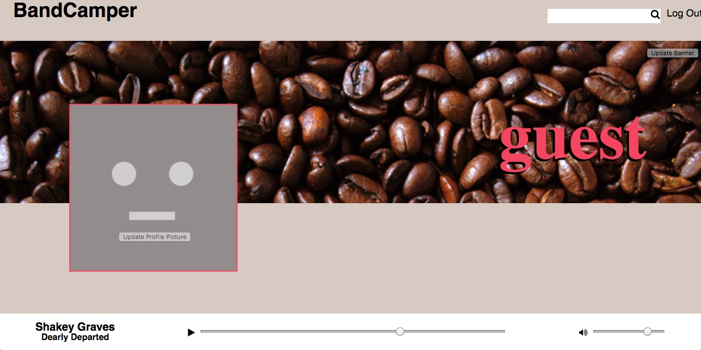
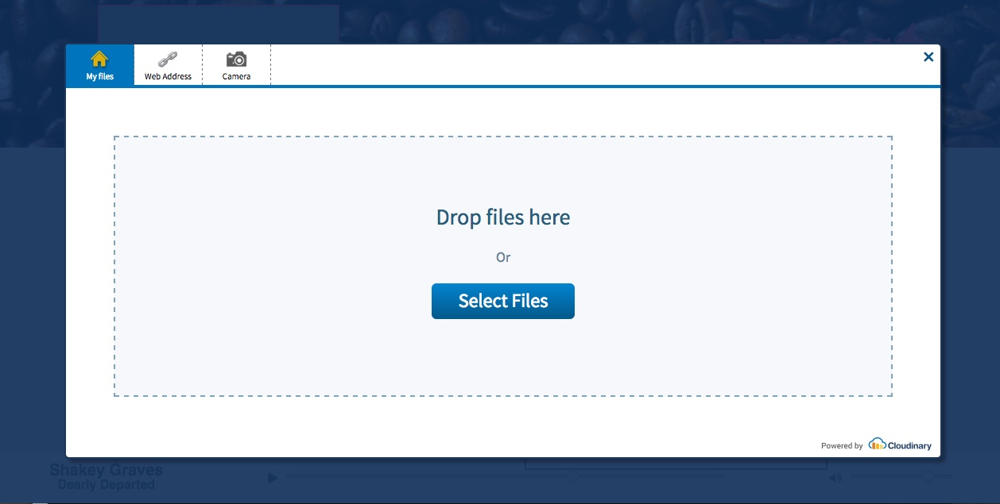
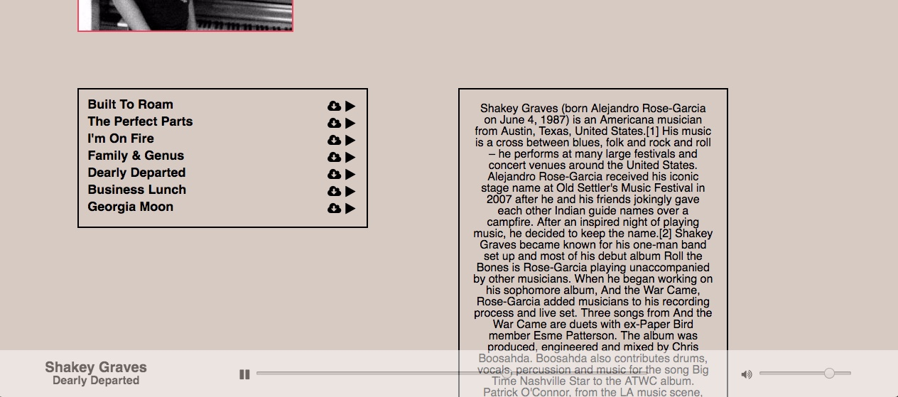
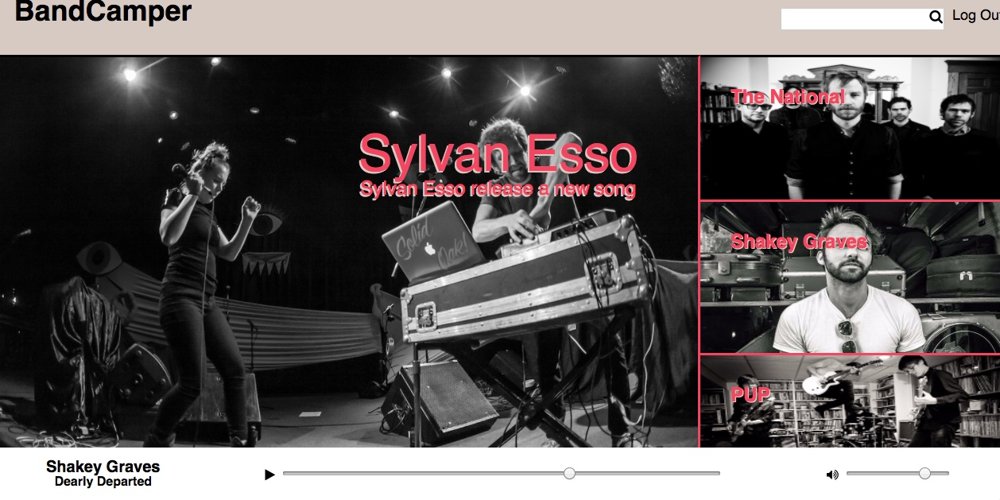
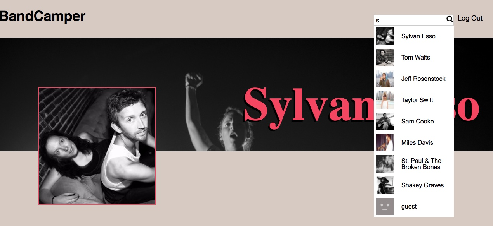

#BandCamper
[BandCamper live](bandcamper.net)

#Features & Implementation

##User Profile
Using the Cloudinary widget for storage, Users can upload songs and profile and banner images. React uses the success calls from these uploads to send AJAX requests to my rails backend which associates the urls with the other data collected on signup.  When a user upload a song, react also uses the filename for the song title. After the initial upload, any time that anyone visits that users profile three separate components render the banner, profile picture and a song list.

In order to keep users from being able to edit others information, I used the react router to only render the upload tools at the '/profile.' My backend also checks if the the request was made from a logged in user, and that the update would only effect their account.

##Other Artists Profiles

Using a similar template to the users profile, users can view other artists and their images and songs but not edit them.

Users can also pay songs from other artist and and their own profiles using the media player.

##MediaPlayer
The media player is a react component that is fixed to the bottom of the page at all times.  This separation allows users to select a song to play then continue navigate the site while the song continues to be played, and the controls for that songs playback are still available at the bottom of the page.

##Search
Search makes an AJAX request on every keystroke to fetch and display a list of artists

